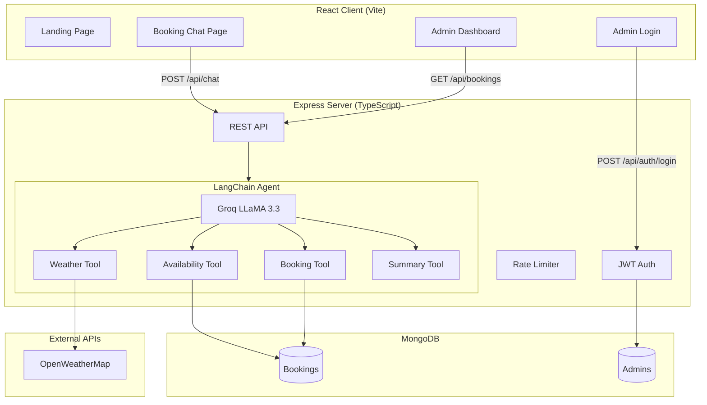

# 🍽️ WhisperBite — Agentic AI Restaurant Reservation Platform

> **AI-powered restaurant reservation system** with voice booking, multi-turn conversation, weather-aware seating, and admin analytics.

## ✨ Features

| Feature | Description |
|---------|-------------|
| 🤖 AI Agent | LangChain-powered conversational booking assistant (Groq LLaMA 3.3 70B) |
| 🎙️ Voice Booking | Speak to book — Web Speech API (STT + TTS) |
| 🧠 Multi-turn Memory | Session-based slot filling with correction support |
| 🌦️ Weather-Aware | OpenWeatherMap integration for seating recommendations |
| 📅 Real-time Availability | Capacity-aware slot checking with alternatives |
| 🔐 Admin Auth | JWT-based authentication with protected routes |
| 📊 Analytics Dashboard | Charts: peak hours, cuisine distribution, daily trends |
| 🎨 Dark/Light Mode | Premium UI with Framer Motion animations |

## 🏗️ Architecture



## 🛠️ Tech Stack

**Frontend:** React, Vite, React Router, Framer Motion, Recharts, Lucide Icons  
**Backend:** Node.js, Express, TypeScript, LangChain, Groq API  
**Database:** MongoDB + Mongoose  
**AI:** LLaMA 3.3 70B (via Groq), LangChain tool-calling agent  
**Voice:** Web Speech API (SpeechRecognition + SpeechSynthesis)

## 🚀 Quick Start

### Prerequisites
- Node.js 18+
- MongoDB (local or Atlas)
- Groq API key ([console.groq.com](https://console.groq.com))
- OpenWeatherMap API key ([openweathermap.org](https://openweathermap.org/api))

### Setup

```bash
# 1. Clone
git clone <repo-url>
cd WhisperBite

# 2. Server
cd server
cp .env.example .env     # ← Add your API keys here
npm install
npm run seed              # Creates default admin (admin@whisperbite.com / WhisperBite@2024)
npm run dev               # Starts on :5000

# 3. Client (new terminal)
cd client
npm install
npm run dev               # Starts on :5173
```

### Environment Variables

| Variable | Description |
|----------|-------------|
| `GROQ_API_KEY` | Groq API key for LLaMA 3 |
| `OPENWEATHERMAP_API_KEY` | Weather forecast API |
| `MONGODB_URI` | MongoDB connection string |
| `JWT_SECRET` | Secret for JWT signing |
| `JWT_EXPIRY` | Token expiry (default: `24h`) |
| `MAX_GUESTS_PER_SLOT` | Capacity per time slot (default: `20`) |
| `BCRYPT_SALT_ROUNDS` | Password hashing rounds (default: `12`) |

## 📋 API Endpoints

| Method | Endpoint | Auth | Description |
|--------|----------|------|-------------|
| POST | `/api/chat` | - | Chat with AI agent (rate-limited) |
| POST | `/api/auth/login` | - | Admin login → JWT |
| GET | `/api/auth/verify` | JWT | Verify token |
| GET | `/api/bookings` | Admin | List bookings (paginated, filterable) |
| GET | `/api/bookings/analytics` | Admin | Dashboard analytics |
| GET | `/api/bookings/:id` | Admin | Get booking details |
| DELETE | `/api/bookings/:id` | Admin | Soft-cancel booking |
| PATCH | `/api/bookings/:id/status` | Admin | Update booking status |
| GET | `/api/bookings/availability` | - | Check slot availability |

## 🧠 Design Decisions

**Why one LangChain agent?** A single agent with multiple tools is simpler to reason about and maintain than chained agents. The tool-calling pattern lets the LLM decide which tools to invoke based on context.

**Why tool-based architecture?** Each tool has a single responsibility (weather, availability, booking, summary). This makes testing, error handling, and fallback logic clean and isolated.

**Why in-memory session memory?** For a demo/portfolio project, in-memory is sufficient. The code is structured to easily swap to Redis/MongoDB persistence. Stale sessions auto-cleanup after 1 hour.

**Why Web Speech API?** Browser-native, zero dependencies, works in Chrome without server-side processing. Good enough for demo; production would use Deepgram/Whisper.

**Why soft-delete bookings?** Real restaurants never permanently delete reservation records. Setting `status: "cancelled"` preserves history for analytics.

**Why optimistic concurrency?** Mongoose's `optimisticConcurrency` option prevents race conditions when two admin users try to update the same booking simultaneously.

## 📁 Project Structure

```
WhisperBite/
├── client/                   # React frontend
│   └── src/
│       ├── components/
│       │   ├── chat/         # ChatBubble, VoiceInput, WeatherCard, BookingSummaryModal
│       │   ├── admin/        # BookingTable, Analytics
│       │   └── shared/       # Navbar, ErrorBoundary, SkeletonLoader, etc.
│       ├── context/          # ThemeContext, AuthContext
│       ├── pages/            # LandingPage, BookingPage, AdminLoginPage, AdminPage
│       └── styles/           # globals.css (design system)
├── server/                   # Express + TypeScript backend
│   └── src/
│       ├── agents/           # reservationAgent.ts (LangChain)
│       ├── tools/            # weatherTool, availabilityTool, bookingTool, summaryTool
│       ├── controllers/      # chatController, bookingController, authController
│       ├── middleware/        # errorHandler, rateLimiter, requireAdmin
│       ├── models/           # Booking, Admin
│       ├── services/         # sessionManager
│       ├── routes/           # chat, bookings, auth
│       ├── utils/            # logger, apiResponse, withTimeout
│       ├── config/           # centralized env config
│       └── scripts/          # seedAdmin
└── .env.example
```
