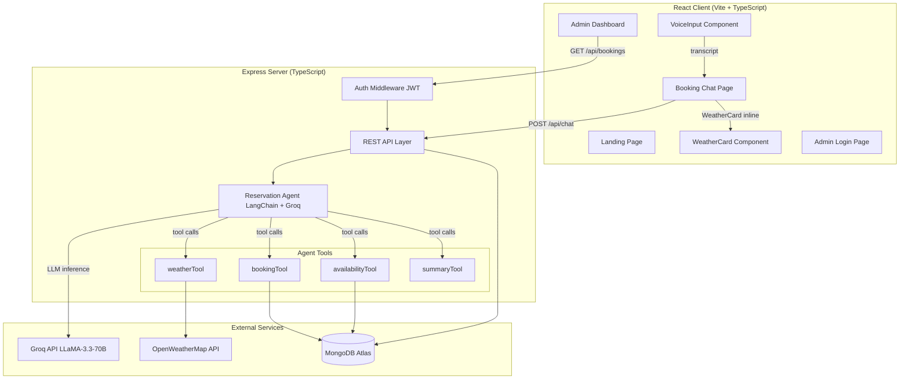

# WhisperBite — Agentic AI Restaurant Reservation Platform

> **AI-powered restaurant reservation chatbot** with voice booking, multi-turn conversation, weather-aware seating, and a full admin analytics dashboard. Built with React + TypeScript, Express + TypeScript, LangChain, Groq LLaMA-3.3-70B, and MongoDB.

---

## Table of Contents

1. [Features](#features)
2. [Tech Stack](#tech-stack)
3. [Architecture](#architecture)
4. [Project Structure](#project-structure)
5. [Getting Started](#getting-started)
6. [Environment Variables](#environment-variables)
7. [Running Locally](#running-locally)
8. [API Endpoints](#api-endpoints)
9. [How It Works](#how-it-works)
10. [Admin Dashboard](#admin-dashboard)
11. [Spec Compliance Checklist](#spec-compliance-checklist)

---

## Features

| Feature | Description |
|---|---|
| **AI Reservation Agent** | LangChain tool-calling loop with Groq LLaMA-3.3-70B � collects name, date, time, guests, cuisine, seating, special requests |
| **Voice Booking (Web Speech API)** | Browser-native STT (en-IN locale) + TTS with mute toggle and live speaking indicator |
| **Multi-turn Conversation** | Session-aware slot filling; agent corrects, confirms, and re-asks misunderstood fields |
| **Weather-Aware Seating** | OpenWeatherMap forecast for booking date ? recommends indoor/outdoor based on Mumbai climate |
| **Booking Summary Modal** | Copy-to-clipboard + "Book Another Table" reset after confirmation |
| **Admin Dashboard** | JWT-protected; view/confirm/cancel bookings, date range filter, CSV export, analytics charts |
| **Editorial Dark UI** | Playfair Display headings, gold accent (#c9a96e), Framer Motion animations |

---

## Tech Stack

| Layer | Technology |
|---|---|
| Frontend | React 18, TypeScript, Vite, Framer Motion, Lucide React |
| Backend | Node.js, Express, TypeScript |
| AI Agent | LangChain (`@langchain/groq`), Groq LLaMA-3.3-70B |
| Database | MongoDB with Mongoose (`optimisticConcurrency: true`) |
| Auth | JSON Web Tokens (JWT) |
| Voice | Web Speech API (`SpeechRecognition` + `SpeechSynthesis`) |
| Weather | OpenWeatherMap 5-day Forecast API |
| Fonts | Playfair Display, Lato (Google Fonts) |

---

## Architecture



---

## Project Structure

```
WhisperBite/
+-- client/                    # React + TypeScript frontend
�   +-- src/
�       +-- components/
�       �   +-- admin/         # BookingTable, Analytics
�       �   +-- chat/          # ChatBubble, VoiceInput, WeatherCard, BookingSummaryModal
�       �   +-- shared/        # Navbar, SkeletonLoader, TypingIndicator, ProtectedRoute
�       +-- context/           # AuthContext, ThemeContext
�       +-- pages/             # LandingPage, BookingPage, AdminPage, AdminLoginPage
�       +-- styles/            # globals.css
+-- server/                    # Express + TypeScript backend
    +-- src/
        +-- agents/            # reservationAgent.ts (LangChain tool-calling loop)
        +-- controllers/       # authController, bookingController, chatController
        +-- middleware/        # errorHandler, rateLimiter, requireAdmin
        +-- models/            # Admin.ts, Booking.ts
        +-- routes/            # auth, bookings, chat, transcribe
        +-- scripts/           # seedAdmin.ts
        +-- services/          # sessionManager.ts
        +-- tools/             # availabilityTool, bookingTool, weatherTool, summaryTool
        +-- utils/             # apiResponse, logger, withTimeout
```

---

## Getting Started

### Prerequisites

- Node.js >= 18
- MongoDB Atlas URI (or local MongoDB)
- [Groq API key](https://console.groq.com/)
- [OpenWeatherMap API key](https://openweathermap.org/api)

### Installation

```bash
# Clone the repository
git clone https://github.com/atharvgk/WhisperBite.git
cd WhisperBite

# Install server dependencies
cd server && npm install

# Install client dependencies
cd ../client && npm install
```

---

## Environment Variables

### Server (`server/.env`)

```env
PORT=5000
MONGODB_URI=mongodb+srv://<user>:<pass>@cluster.mongodb.net/whisperbite
JWT_SECRET=your_jwt_secret_here
GROQ_API_KEY=gsk_...
OPENWEATHER_API_KEY=your_owm_key_here
MAX_GUESTS_PER_SLOT=50
```

### Client (`client/.env`)

```env
VITE_API_URL=http://localhost:5000/api
```

---

## Running Locally

```bash
# Terminal 1 � start the backend
cd server
npm run dev

# Terminal 2 � start the frontend
cd client
npm run dev
```

Open http://localhost:5173 in your browser.

### Seed Admin Account

```bash
cd server
npx ts-node src/scripts/seedAdmin.ts
# Default credentials: admin@whisperbite.com / admin123
```

---

## API Endpoints

### Chat

| Method | Endpoint | Description |
|---|---|---|
| `POST` | `/api/chat` | Send message to AI agent |

### Bookings (Admin � JWT required)

| Method | Endpoint | Description |
|---|---|---|
| `GET` | `/api/bookings` | List bookings with pagination, search, status, dateFrom, dateTo filters |
| `DELETE` | `/api/bookings/:id` | Cancel a booking |
| `PATCH` | `/api/bookings/:id/status` | Update booking status |
| `GET` | `/api/bookings/analytics` | Aggregate analytics data |

### Auth

| Method | Endpoint | Description |
|---|---|---|
| `POST` | `/api/auth/login` | Admin login � returns JWT |

---

## How It Works

### 1. Voice Booking

The `VoiceInput` component uses the browser's `SpeechRecognition` API (en-IN locale) for speech-to-text. Interim transcripts display in real-time while the user speaks. On finalisation the transcript is sent to the agent. Text-to-speech uses `SpeechSynthesis` with voice priority: Google UK English Female ? Microsoft Zira ? first available. A mute toggle and live speaking indicator with stop button are included.

### 2. AI Reservation Agent

`reservationAgent.ts` runs a LangChain tool-calling loop (up to 4 retries) with Groq LLaMA-3.3-70B. The agent has a Mumbai-specific system prompt with Hinglish support and structured tool usage:

| Tool | Purpose |
|---|---|
| `check_availability` | Validates slot availability; returns �2hr alternatives on conflict |
| `create_booking` | Writes booking to MongoDB with BK-{timestamp} ID |
| `check_weather` | Fetches OWM forecast for the booking date; recommends seating |
| `get_booking_summary` | Retrieves and formats the full confirmation details |

The agent explicitly confirms the parsed date ("I have Friday, 14 March at 7:00 PM � is that right?") before booking.

### 3. Weather-Aware Seating

`weatherTool.ts` queries the OWM 5-day forecast and finds the closest 3-hour entry to the booking datetime. It extracts `description` (e.g. "light rain") and `icon` (e.g. "10d"), then applies Mumbai-climate logic:

- 18�35�C, no precipitation ? **outdoor**
- >35�C ? **indoor (AC recommended)**
- Rain / thunderstorm ? **indoor**

The `WeatherCard` is rendered **inline in the chat** immediately after the assistant message that contains weather data.

### 4. Booking Confirmation

After `create_booking` succeeds, the agent calls `get_booking_summary` and returns the formatted confirmation. The client parses the `BK-` ID from the response and opens `BookingSummaryModal` with full booking details, copy-to-clipboard with toast, and a "Book Another Table" reset button.

---

## Admin Dashboard

Access at `/admin/login` with seeded credentials.

**Features:**
- **Bookings tab**: paginated table with search (by name/ID/cuisine), status filter (pending/confirmed/cancelled), date range filter (dateFrom / dateTo), confirm/cancel actions per row
- **CSV Export**: one-click download of all currently filtered bookings as a dated `.csv` file
- **Analytics tab**: peak hours bar chart, cuisine distribution pie chart, daily booking trend line chart

---

## Spec Compliance Checklist

### Backend

- [x] Booking schema: `bookingId` (BK-{timestamp}), `bookingDate` (Date type), `bookingTime` (12h string), `cuisinePreference` enum, `weatherInfo.description`, `weatherInfo.icon`, `numberOfGuests` max 20, `seatingPreference` with "no preference" option, `optimisticConcurrency: true`
- [x] `availabilityTool`: double-booking detection (same name + date + time), capacity check via `config.maxGuestsPerSlot`, �2hr alternative slots from 11 AM�9 PM range
- [x] `bookingTool`: BK-timestamp ID generation, `bookingDate: new Date(input.bookingDate)`, 12h time normalisation, weather `description` + `icon` stored
- [x] `weatherTool`: default city Mumbai, extracts `description` + `icon` from OWM response, seating logic based on Mumbai climate thresholds
- [x] `summaryTool`: fetches booking by `bookingId` from MongoDB, returns formatted emoji string
- [x] `bookingController.getAllBookings`: `dateFrom`/`dateTo` query params filter on `bookingDate` field using `$gte`/`$lte`
- [x] Agent system prompt: Mumbai restaurant context, Hinglish support, date confirmation pattern, calls `get_booking_summary` after `create_booking`

### Frontend

- [x] TypeScript migration � all `.jsx` ? `.tsx`, explicit prop interfaces on every component
- [x] `VoiceInput`: Web Speech API (replaces MediaRecorder/Groq Whisper), `lang: 'en-IN'`, interim transcripts, pulse ring animation, cancel TTS on mic press, mute toggle with Volume2/VolumeX icon, speaking indicator + StopCircle stop button
- [x] Session ID persisted in `localStorage` (not `sessionStorage`)
- [x] `LandingPage`: editorial dark theme (#0f0e0d), Playfair Display headings, hero with italic emphasis, 3-feature card grid, 4-step "How It Works" timeline with connectors, footer with Admin Dashboard link
- [x] `ChatBubble`: timestamps shown on hover (`opacity: 0` ? `opacity: 1` CSS transition)
- [x] `WeatherCard` rendered inline after the assistant message containing weather data (not floating outside chat)
- [x] `BookingSummaryModal`: copy-to-clipboard with `toast.success`, "Book Another Table" calls `onReset` / `handleClearChat`
- [x] Admin `BookingTable`: date range filter inputs (dateFrom / dateTo), CSV export button with `Blob` + `URL.createObjectURL`

---

*WhisperBite � Mumbai's smartest table, reserved by voice.*
